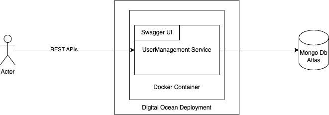

# Design Document

## Project Overview

This document outlines the design decisions for the Spring Boot Java REST server that interacts with MongoDB. The server is designed to be used in a micro-service architecture, focusing on scalability, maintainability, and performance.

## Architecture

### REST API Design

- **Implementation**: APIs are designed to be idempotent where possible with clear HTTP status codes for easy client-side integration and error handling.

### Error Handling

- **Controller Advice**: Global exception handling using `@ControllerAdvice` to handle exceptions across all controllers. Provides a consistent error response format for all exceptions.

### Current Architecture

## Database Design

### Schema Design

- **Cycle Collection**: Stores billing cycles with fields for user ID, start and end dates, and related metadata.
- **User Collection**: Maintains user profile information, including authentication details.
- **Daily Usage Collection**: Records data usage on a daily basis, updated every 15 minutes to reflect real-time usage stats.
- **Date Format**: Dates are stored in millisecond epoch format to ensure consistency across different time zones, daylight saving time changes, leap years, and easy date arithmetic.

### Scaling Considerations

- **Cycle Collection**: Assumed to have 10 million documents.
- **User Collection**: Assumed to have 1 million documents.
- **Daily Usage Collection**: Assumed to have 50 million documents.

### Indexing Strategy
- **Cycle Collection**: Compound Indexes on user Id and mdn for efficient querying. Adding indexes on start and end dates for range queries seems unnecessary given the data size of 10 cycles per user, but can be considered if the data size grows significantly or performance issues arise.
- **User Collection**: Index on email for quick user profile checks.
- **Daily Usage Collection**: Compound Index user Id, mdn and date for fast retrieval of daily usage data.

If we compound index on (ABC) - it can be used for queries on A, AB, ABC but not on B or C. The queries are also written to ensure that we filter by A first, then AB, then ABC. This is to ensure that the indexes are used efficiently.

**Note**: Indexes on the _id(generated on Mongodb) are created by default, and help in the query performance too.

### Strategies evaluated for scaling, but not implemented in this version:

- **Sharding**: Horizontal scaling of MongoDB clusters to distribute data across multiple servers.
Given the current data size (10 million cycles, 1 million users, 50 million daily usage records) and assuming 50 Bytes for each document (500MB for cycles, 50MB for users, 2.5GB for daily usage), the total data size is around 3GB. Even if we consider a 2x growth in the short term, 6GB is still manageable on a single server. MongoDb recommends sharding around 500GB - 1TB ranges. However, Sharding can definitely be considered to improve latencies if they are at unacceptable levels.
For Users, Daily Usage, and Cycle History - Hash based sharding on User Id - should gives us enough distribution but also helps in case of query joins to not have data scattered across multiple shards.
- **Indexing**: For 100 million entries, each index might roughly be 20 bytes * 100,000,000 = 2GB. For 3 such indexes, 6GB. This 6GB data will be constantly occupying the RAM, hence our server should have enough RAM to accommodate this. If the RAM is not enough, the indexes will be swapped to disk, which will slow down the queries. Hence, the server should have enough RAM to accommodate the indexes.
- **TimeSeries Collections**: For Daily Usage, we can consider using TimeSeries collections, which are optimized for time-based data. This can help in faster queries and aggregations on time-based data. But given the current data size of only 5 records per cycle, the performance improvement might not be significant.
- **Capped Collections**: For Daily Usage, we can consider using Capped Collections, which are fixed-size collections that automatically remove the oldest entries when the collection reaches its maximum size. This can help in managing the data size and prevent the collection from growing indefinitely. But given the current data size of only 5 records per cycle, the performance improvement might not be significant.
- **Data Archiving**: For historical data, we can consider archiving older records to a separate storage system to reduce the load on the primary database. This can help in managing large volumes of data and optimizing query performance. But given the current data size and query patterns, the performance improvement might not be significant.

## Security Considerations

- **Data Storage**: Critical data, such as user passwords, are salted and hashed using industry-standard Bcrypt algorithm, which can be used to verify if provided password is correct, but cannot be feasibly used to extract the original user password. This ensures that even if the database is compromised, user passwords remain secure. The Bcrypt algorithm also includes a salt, which prevents the use of precomputed hash tables for password cracking.

## Technology Stack

- **Docker**: Facilitates consistent development, testing, and production environments, simplifying deployment and scaling.

## Testing Strategy

- **Unit Testing**: Using JUnit to test individual components.
- **Integration Testing**: Using MongoDB Test Containers to ensure the application interacts correctly with the database as it would in a production environment.

## Scalability and Performance

- **Reactive Programming**: Using Spring WebFlux to handle asynchronous and non-blocking operations can also be considered to improve performance and scalability. They greatly help to reduce latency and improve throughput by handling more requests with the same resources.
- **Caching**: Implementing caching strategies using Redis or Memcached can help reduce the load on the database and improve response times for frequently accessed data.
- **Horizontal Scaling**: Deploying multiple instances of the application behind a load balancer can help distribute the load and improve performance. This can be achieved using container orchestration tools like Kubernetes. Our current usage of Docker can be easily scaled to Kubernetes.

## Conclusion

The design choices made for this project are aimed at building a robust, scalable, and maintainable system that leverages modern technology stacks and follows best practices in software architecture.

